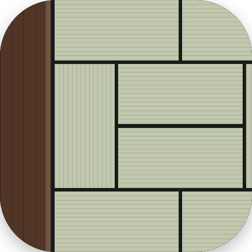

# Zashiki

  

[@kawaken](https://github.com/kawaken)'s private, macOS-only fork of
[Ghostty](https://github.com/ghostty-org/ghostty).

## Fork-specific features

- **ATOK / Japanese IME preedit styling** — the clause currently being
  converted gets a thicker underline than the rest of the preedit text,
  matching how ATOK itself distinguishes it.
